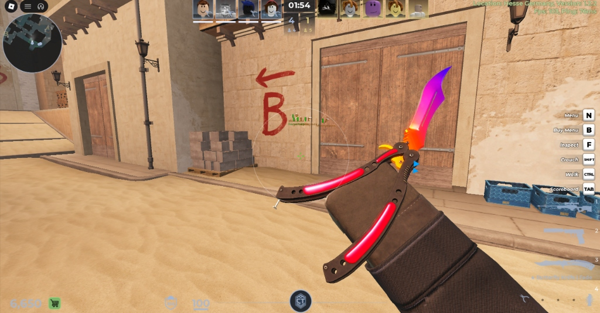
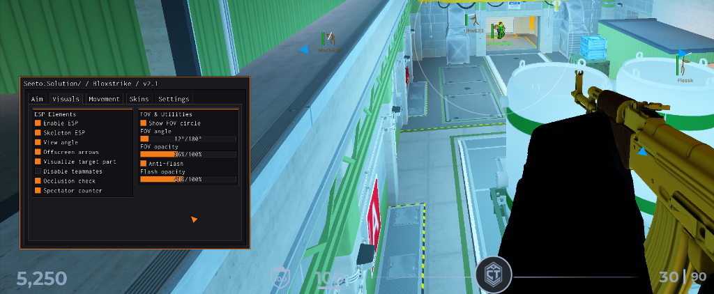

# Seeto.SolutionZ / Bloxstrike

> Lightweight, modular utility suite for Bloxstrike.





## Loadstring

```lua
loadstring(game:HttpGet("https://raw.githubusercontent.com/koko29907/Seeto.SolutionZ-Bloxstrike/main/init.lua"))()
```

## Features

- **Aim**: Angular FOV silent aim, lethal hitbox priority calculation, target lock.
- **Visuals**: 3D skeleton bone ESP, health indicators, view angle vectors, offscreen directional arrows, spectator monitor.
- **Movement**: B-Hop.
- **Skins**: Custom knife/skins.
- **Utilities**: Anti-Flash.
- **Interface**: High-performance LinoriaLib GUI, customizable binds, auto-saving config.

## Default Binds

- **Menu**: Insert / Right Shift
- **Kill / Panic**: K
